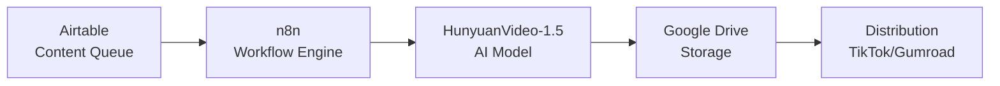

# 🎬 EchoBloom AI Video Automation System

**Automated AI-powered video generation pipeline for certification training content**

[](https://opensource.org/licenses/MIT)
[](https://n8n.io)
[](https://github.com/Tencent-Hunyuan/HunyuanVideo-1.5)

---

## 🚀 What This Does

Automatically generates professional certification training videos using AI, with **zero ongoing API costs**. Simply add topics to Airtable, and the system:

1. ✅ Generates AI video from text prompts
2. ✅ Uploads to Google Drive
3. ✅ Updates tracking database
4. ✅ Ready for distribution (TikTok, Gumroad, etc.)

**Perfect for:** Educational content creators, certification trainers, online course producers

---

## 🎯 Key Features

- **🤖 Open Source AI:** Uses HunyuanVideo-1.5 (8.3B parameters, state-of-the-art quality)
- **💰 Zero API Costs:** Self-hosted model, no per-video fees
- **⚡ Fully Automated:** Airtable → n8n → AI → Google Drive
- **📊 Content Management:** Track everything in Airtable
- **🔄 Scalable:** Generate 10-100+ videos per day
- **🎨 Professional Quality:** 1080p, 5-10 second videos

---

## 📋 System Architecture



---

## 🛠️ Tech Stack

| Component | Technology | Cost |
|-----------|------------|------|
| **AI Video Generation** | HunyuanVideo-1.5 (Tencent) | Free (open source) |
| **Workflow Automation** | n8n | Free (self-hosted) |
| **Content Database** | Airtable | Free tier |
| **Storage** | Google Drive | Free (15 GB) |
| **Compute** | Local GPU or Cloud GPU | $0 or $0.20-$0.80/hour |
| **Version Control** | GitHub | Free |

---

## 📦 What's Included

```
echobloom-automation/
├── n8n-workflows/
│   └── ai-video-generation-workflow.json    # Main automation workflow
├── airtable-schemas/
│   └── content-queue-schema.json            # Database structure
├── github-workflows/
│   └── deploy-n8n-workflows.yml             # CI/CD pipeline
├── docs/
│   ├── SETUP_GUIDE.md                       # Complete setup instructions
│   └── API_REFERENCE.md                     # HunyuanVideo API docs
└── README.md                                # This file
```

---

## 🚀 Quick Start

### Prerequisites

- **GPU:** NVIDIA with 14+ GB VRAM (or cloud GPU account)
- **OS:** Ubuntu 22.04+ or macOS
- **Accounts:** Airtable, Google Drive, n8n (optional)

### 1. Clone Repository

```bash
git clone https://github.com/EchoBloomSolutions2025/echobloom-automation.git
cd echobloom-automation
```

### 2. Set Up HunyuanVideo AI

```bash
# Clone and install HunyuanVideo
git clone https://github.com/Tencent-Hunyuan/HunyuanVideo-1.5.git
cd HunyuanVideo-1.5
pip install -r requirements.txt

# Download model weights
python scripts/download_models.py

# Start API server
python api_server.py --host 0.0.0.0 --port 8000
```

### 3. Set Up Airtable

1. Create new base: "EchoBloom Content Pipeline"
2. Import schema from `/airtable-schemas/content-queue-schema.json`
3. Get API credentials from airtable.com/account

### 4. Deploy n8n Workflow

```bash
# Option A: Self-hosted (Docker)
docker run -it --rm --name n8n -p 5678:5678 -v ~/.n8n:/home/node/.n8n n8nio/n8n

# Option B: n8n Cloud
# Sign up at n8n.io/cloud
```

Import workflow from `/n8n-workflows/ai-video-generation-workflow.json`

### 5. Test the Pipeline

Add a test record to Airtable:
- **Certification:** CIPP/US
- **Content Type:** Study Guide
- **Topic:** Introduction to Privacy Principles
- **Status:** Queued

Watch the automation run! Video will appear in Google Drive in 1-2 minutes.

---

## 📖 Full Documentation

- **[Complete Setup Guide](docs/SETUP_GUIDE.md)** - Step-by-step instructions
- **[API Reference](docs/API_REFERENCE.md)** - HunyuanVideo API details
- **[Troubleshooting](docs/SETUP_GUIDE.md#troubleshooting)** - Common issues and fixes

---

## 💰 Cost Breakdown

### Zero-Cost Setup (Local GPU)
- HunyuanVideo: **$0** (open source)
- n8n: **$0** (self-hosted)
- Airtable: **$0** (free tier, 1,200 records)
- Google Drive: **$0** (15 GB free)
- **Total: $0/month**

### Low-Cost Setup (Cloud GPU)
- Cloud GPU (RunPod/Vast.ai): **$0.20-$0.80/hour** (only when generating)
- n8n Cloud (optional): **$20/month**
- Airtable Pro (optional): **$20/month**
- **Total: $20-$40/month + GPU usage**

**Example:** 50 videos/week = ~2.5 hours GPU time = **$0.50-$2.00/day** = **$15-$60/month**

---

## 🎯 Use Cases

### Certification Training
- CIPP/US, CIPM, CIPT (Privacy)
- PMP, CAPM (Project Management)
- CISSP, Security+ (Cybersecurity)
- AWS, GCP, Azure (Cloud)

### Content Types
- 📚 Study guides
- ❓ Practice questions
- 💡 Concept explanations
- 🎯 Exam tips
- 🌍 Real-world scenarios

### Distribution Channels
- TikTok (short-form videos)
- YouTube Shorts
- Instagram Reels
- Gumroad (digital products)
- Course platforms (Teachable, Thinkific)

---

## 🔧 Configuration

### Environment Variables

```bash
# n8n Configuration
N8N_API_URL=https://your-n8n-instance.com
N8N_API_KEY=your_api_key

# HunyuanVideo API
HUNYUAN_VIDEO_API_ENDPOINT=http://localhost:8000

# Airtable
AIRTABLE_API_KEY=your_airtable_key
AIRTABLE_BASE_ID=your_base_id

# Google Drive
GOOGLE_DRIVE_FOLDER_ID=your_folder_id
```

---

## 📈 Scaling

### Production Recommendations

| Videos/Day | GPU Hours | Monthly Cost | Setup |
|------------|-----------|--------------|-------|
| 10 | 0.5 hours | $3-$12 | Single cloud GPU |
| 50 | 2.5 hours | $15-$60 | Single cloud GPU |
| 100 | 5 hours | $30-$120 | 2x cloud GPUs |
| 500+ | 25+ hours | $150-$600 | Dedicated GPU cluster |

---

## 🤝 Contributing

Contributions welcome! Please:

1. Fork the repository
2. Create a feature branch (`git checkout -b feature/amazing-feature`)
3. Commit changes (`git commit -m 'Add amazing feature'`)
4. Push to branch (`git push origin feature/amazing-feature`)
5. Open a Pull Request

---

## 📄 License

This project is licensed under the MIT License - see the [LICENSE](LICENSE) file for details.

---

## 🙏 Acknowledgments

- **[HunyuanVideo](https://github.com/Tencent-Hunyuan/HunyuanVideo-1.5)** by Tencent - State-of-the-art open source video generation
- **[n8n](https://n8n.io)** - Powerful workflow automation platform
- **[Airtable](https://airtable.com)** - Flexible content management database

---

## 📞 Support

- **Issues:** [GitHub Issues](https://github.com/EchoBloomSolutions2025/echobloom-automation/issues)
- **Discussions:** [GitHub Discussions](https://github.com/EchoBloomSolutions2025/echobloom-automation/discussions)
- **Email:** echobloomsolutionsllc@gmail.com

---

## 🎯 Roadmap

- [x] Core automation pipeline
- [x] HunyuanVideo integration
- [x] Airtable content management
- [x] Google Drive storage
- [ ] TikTok auto-upload
- [ ] YouTube Shorts integration
- [ ] Replicate API fallback
- [ ] Advanced video editing (captions, music)
- [ ] Multi-language support
- [ ] Analytics dashboard

---

## 📊 Project Stats


---

**Built with ❤️ by [EchoBloom Solutions](https://linktr.ee/echobloomsolutions)**

*Empowering creators with AI automation*
